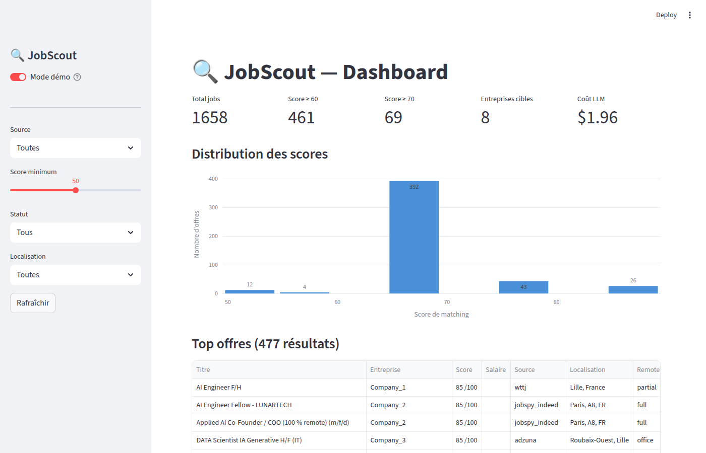

# 🔍 JobScout

**AI-powered job search automation — scrape, score, and track opportunities while you sleep.**

[](https://www.python.org/downloads/)
[](LICENSE)
[](https://github.com/ThomasMeb/JobScout/stargazers)

> JobScout is an autonomous agent that continuously scrapes job boards, scores each opportunity against your profile using an LLM, and notifies you on Telegram — so you only see the jobs that actually match.

```
5 sources → 2,000+ jobs → LLM scoring → Telegram alerts → Notion tracking
```

---

## Dashboard



## Why JobScout?

| Without JobScout | With JobScout |
|------------------|---------------|
| Manually check 5+ job boards daily | Agent scrapes every 6h automatically |
| Skim hundreds of irrelevant listings | LLM scores each job 0-100 against YOUR profile |
| Miss good opportunities | Telegram alert within minutes |
| Lose track of applications | Notion CRM auto-populated |
| Spend hours, find little | **2,000 jobs scored for ~$1.50** |

---

## Features

- **Multi-source scraping** — Welcome to the Jungle, Adzuna, France Travail, RemoteOK, JobSpy (Indeed/LinkedIn/Glassdoor)
- **LLM scoring** — Each job scored 0-100 with reasoning, matched keywords, and missing skills
- **Telegram bot** — Real-time notifications with action buttons (Interested / Reject / Prepare CV)
- **Notion sync** — Jobs and target companies pushed to your workspace automatically
- **Company targeting** — Manual watchlist + La Bonne Boite API for spontaneous applications
- **Application briefs** — Auto-generated preparation dossiers for top opportunities
- **Streamlit dashboard** — Visual analytics with filters, score distribution, cost tracking
- **Budget control** — Monthly LLM spending cap with automatic enforcement
- **Deduplication** — SHA256 hashing across sources, no duplicate alerts

---

## Architecture

```
┌──────────────────────────────────────────────────────────────┐
│                        JobScout Pipeline                      │
│                      (every 6h, 7am–11pm)                     │
├──────────────────────────────────────────────────────────────┤
│                                                               │
│   ┌─────────┐  ┌─────────┐  ┌───────────┐  ┌──────────┐     │
│   │  WTTJ   │  │ Adzuna  │  │ France    │  │ RemoteOK │     │
│   │ Algolia │  │  API    │  │ Travail   │  │          │     │
│   └────┬────┘  └────┬────┘  └─────┬─────┘  └────┬─────┘     │
│        │            │             │              │            │
│        └────────────┴──────┬──────┴──────────────┘            │
│                            ▼                                  │
│                    ┌───────────────┐      ┌────────────────┐  │
│   ┌─────────┐     │   SQLite DB   │      │   Streamlit    │  │
│   │ JobSpy  │────▶│   (WAL mode)  │◀────▶│   Dashboard    │  │
│   │ Indeed  │     │  dedup + CRUD │      │   analytics    │  │
│   │LinkedIn │     └───────┬───────┘      └────────────────┘  │
│   └─────────┘             │                                   │
│                           ▼                                   │
│                  ┌─────────────────┐                          │
│                  │  DeepSeek LLM   │                          │
│                  │  score 0-100    │                          │
│                  │  + reasoning    │                          │
│                  └────────┬────────┘                          │
│                           │                                   │
│                    ┌──────┴──────┐                            │
│                    ▼             ▼                             │
│            ┌─────────────┐  ┌──────────┐                     │
│            │  Telegram   │  │  Notion  │                     │
│            │  Bot alerts │  │  CRM     │                     │
│            │  + actions  │  │  sync    │                     │
│            └─────────────┘  └──────────┘                     │
│                                                               │
└──────────────────────────────────────────────────────────────┘
```

### Pipeline steps

1. **Scrape** — Fetch jobs from all enabled sources (async)
2. **Deduplicate** — SHA256 hash on title + company + URL
3. **Score** — LLM evaluates job-profile fit (0-100) with detailed reasoning
4. **Notify** — Telegram messages with inline action buttons for jobs above threshold
5. **Research** — Company intelligence via La Bonne Boite + manual targets
6. **Sync** — Push scored jobs and companies to Notion databases

---

## Quick Start

### 1. Clone and install

```bash
git clone https://github.com/ThomasMeb/JobScout.git
cd JobScout
pip install -r requirements.txt
```

> Requires Python 3.12+

### 2. Configure your profile

Copy and edit the config file — this is the only file you need to customize:

```bash
cp config.example.yaml config.yaml
```

```yaml
profile:
  name: "Your Name"
  profile_doc: |
    3 years Python, ML/DL, NLP...
    Looking for: ML Engineer, Data Scientist
    Location: Paris, Remote OK

search:
  queries:
    - "ML Engineer"
    - "Data Scientist"
    - "AI Engineer"
  locations:
    - "Paris"
    - "London"
  remote_accepted: true
  contract_types: ["CDI", "full-time"]
  min_salary: 45000

scoring:
  min_score_notify: 60
  bonus_keywords: [python, pytorch, mlops, docker]
  penalty_keywords: [10+ years, PhD required, Java]
```

### 3. Set up API keys

```bash
cp .env.example .env
# Edit .env with your keys
```

| Service | Where to get it | Required |
|---------|----------------|----------|
| **DeepSeek** | [platform.deepseek.com](https://platform.deepseek.com) | Yes |
| **Telegram Bot** | [@BotFather](https://t.me/BotFather) on Telegram | Yes |
| **Adzuna** | [developer.adzuna.com](https://developer.adzuna.com) | Recommended |
| **France Travail** | [francetravail.io](https://francetravail.io) | Optional |
| **Notion** | [notion.so/my-integrations](https://www.notion.so/my-integrations) | Optional |

<details>
<summary>How to get your Telegram Chat ID</summary>

1. Create a bot via [@BotFather](https://t.me/BotFather) and copy the token
2. Send `/start` to your new bot
3. Run:
```bash
curl https://api.telegram.org/bot<YOUR_TOKEN>/getUpdates
```
4. Copy the `chat.id` value from the response

</details>

### 4. Run

```bash
# Single cycle (scrape + score + notify)
python main.py --once

# Daemon mode (runs every 6h with Telegram bot listener)
python main.py

# Dashboard
streamlit run dashboard.py
```

---

## Configuration

### Sources

Enable/disable scrapers in `config.yaml`:

```yaml
sources:
  wttj:
    enabled: true          # Welcome to the Jungle (Algolia API)
  adzuna:
    enabled: true          # Adzuna API (needs key)
  francetravail:
    enabled: true          # France Travail API (OAuth2)
  remoteok:
    enabled: true          # RemoteOK (no key needed)
  jobspy:
    enabled: true          # Indeed + LinkedIn via JobSpy
  hellowork:
    enabled: false         # Requires Playwright
```

### Target companies

Add companies for spontaneous application tracking:

```yaml
target_companies:
  - name: "Mistral AI"
    website: "https://mistral.ai"
    careers_url: "https://mistral.ai/careers"
    sector: "LLM / AI Research"
    location: "Paris"
    relevance_score: 95
```

### Notion integration

1. Create an integration at [notion.so/my-integrations](https://www.notion.so/my-integrations)
2. Create two databases: **Jobs** and **Companies**
3. Connect your integration to both databases
4. Add the tokens to `.env`

The agent auto-creates all required properties on first sync.

### Telegram commands

| Command | Description |
|---------|-------------|
| `/start` | Initialize the bot |
| `/status` | Global statistics |
| `/pending` | Jobs waiting for review |
| `/companies` | Target companies list |
| `/costs` | LLM spending this month |
| `/pause` / `/resume` | Pause/resume the scheduler |

### Run as a service (systemd)

```bash
mkdir -p ~/.config/systemd/user
cp jobscout.service ~/.config/systemd/user/

systemctl --user daemon-reload
systemctl --user enable --now jobscout

# Check logs
journalctl --user -u jobscout -f
```

---

## Costs

DeepSeek makes this extremely affordable:

| Volume | Cost | Notes |
|--------|------|-------|
| ~1,300 jobs scored | ~$1.00 | First full run |
| ~2,000 jobs scored | ~$1.50 | With dedup, mostly new jobs |
| Monthly estimate | ~$3–5 | 4 cycles/day, budget enforced |

Budget is configurable in `config.yaml` — the agent stops scoring automatically when the monthly limit is reached.

---

## Project Structure

```
JobScout/
├── main.py                    # Entry point (--once / daemon)
├── dashboard.py               # Streamlit dashboard
├── config.example.yaml        # Configuration template
├── .env.example               # API keys template
├── jobscout.service           # systemd unit file
│
├── job_agent/                 # Core library
│   ├── config.py              # Config loader
│   ├── storage.py             # SQLite schema + CRUD
│   ├── llm.py                 # DeepSeek async client
│   ├── matcher.py             # LLM-based job scoring
│   ├── notifier.py            # Telegram bot + notifications
│   ├── scheduler.py           # Pipeline orchestration
│   ├── company_research.py    # La Bonne Boite + targets
│   ├── application_prep.py    # Brief generator
│   ├── notion_sync.py         # Notion API sync
│   └── scrapers/
│       ├── base.py            # BaseScraper ABC
│       ├── wttj.py            # Welcome to the Jungle
│       ├── adzuna.py          # Adzuna API
│       ├── francetravail.py   # France Travail API
│       ├── remoteok.py        # RemoteOK
│       └── jobspy.py          # JobSpy (Indeed + LinkedIn)
│
└── data/                      # SQLite DB + briefs (gitignored)
```

---

## Contributing

Contributions are welcome! Feel free to open issues or PRs.

The architecture is designed to be extensible:
- **Add a scraper**: subclass `BaseScraper` in `job_agent/scrapers/`
- **Change LLM**: swap the `base_url` and `model` in `config.yaml` (any OpenAI-compatible API)
- **Add a notification channel**: extend `notifier.py`

---

## License

MIT — See [LICENSE](LICENSE)
